# How to Use Git/Github Classroom + Gradescope

If you have not already finished setting up everything you needed from Lab 0, please do so. Otherwise, take a read through this doc which covers how to update your local changes to your Github repo and how to turn in your Github repo as an assignment through Gradescope.

### Tracking and Pushing Changes

Let’s say you’ve edited your source code and now want to track the changes you’ve made. For example, maybe you edited main.cpp. 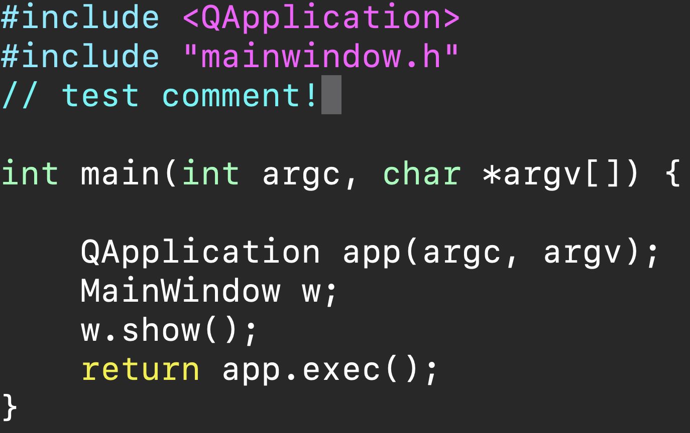

This is vim, a terminal-based editor, so don’t worry too much if your code doesn’t look like this in Qt Creator.

1.  Check the status of your repository by running git status in the repository directory. You should see a bunch of files marked as not staged for commit.
2.  Add your changes by running git add <files to add>. You can also use a pattern instead of filenames like  git add \*.cpp to add all C++ source files. You can check the status of your repository again to verify that all changes you want to track have been added.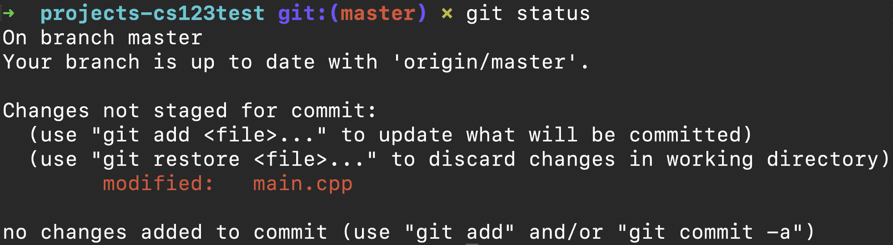

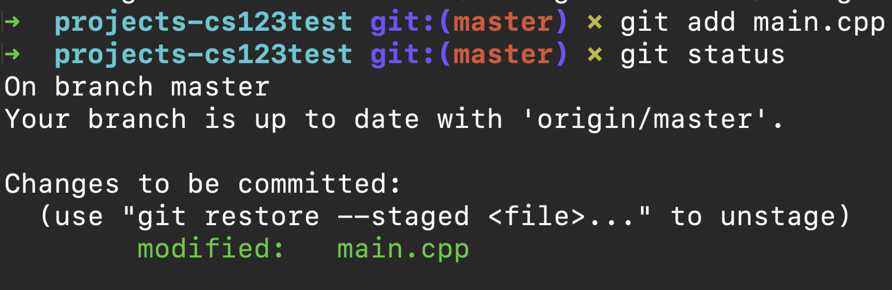

We recommend against adding all changes at once, as this can result in unintended files being tracked in the repository. You should be tracking changes often enough that you should not have many files to add.  

3.  Once all files have been added, you can commit your changes to the branch you are currently working on (for most people, this will be master). Run git commit -m <commit message> with a short, informative message to add all tracked changes to the repository’s history, also known as the tree.

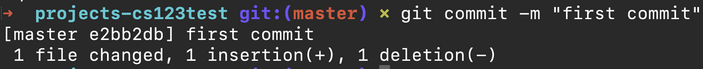

4.  Push your changes to the origin repository (your personal GitHub Classroom repository) using git push origin <branch, typically master\>. You can omit origin <branch>, but it is good practice for students who are newer to Git to make a habit of specifying to cement the idea that git push will update the tree of the origin repository specifically.
5.  Commit (and push) your changes often! This will allow you to go back to working versions of your code if you accidentally change something and break your functionality. GitHub also acts as a relatively reliable external backup for your code if for some reason your computer stops working. 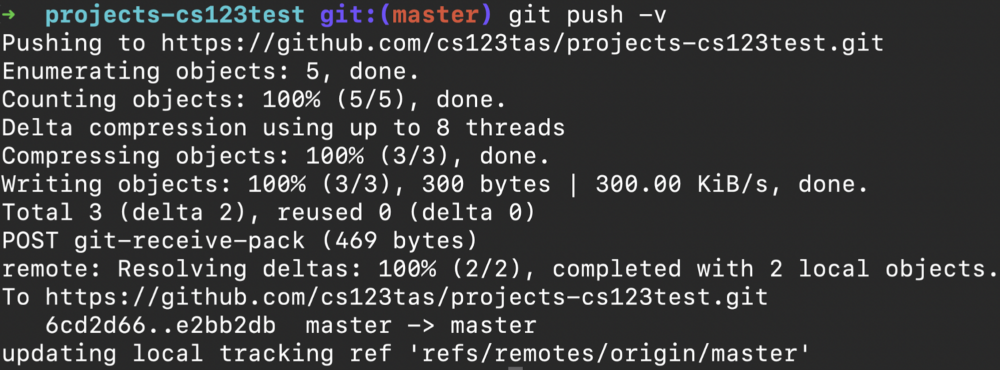

For more information about GitHub, see our [GitHub Guide](https://www.google.com/url?q=https://docs.google.com/document/d/10O6_m-b3nb1XZx9ilxzsN4iHK7D0hWjAs030H2AXSjI/edit?usp%3Dsharing&sa=D&source=editors&ust=1657229381662616&usg=AOvVaw0viE4gdDdb4vjE8TaZ1po4).

### Handing in Assignments

1.  Navigate to your repository on GitHub. To verify that your changes have been properly pushed, you can click through the source code folders and files on the repository page.
2.  Once you are satisfied with the state of your repository, navigate to CS1230 on Gradescope.
3.  Click on the assignment you’d like to hand in.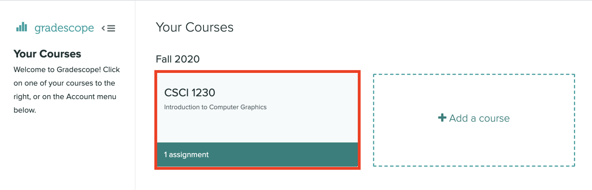

4.  Click Connect to GitHub on the popup submission window. 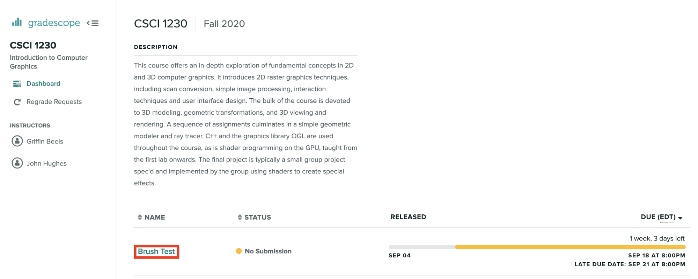
5.  Click Authorize gradescope to continue after signing into GitHub.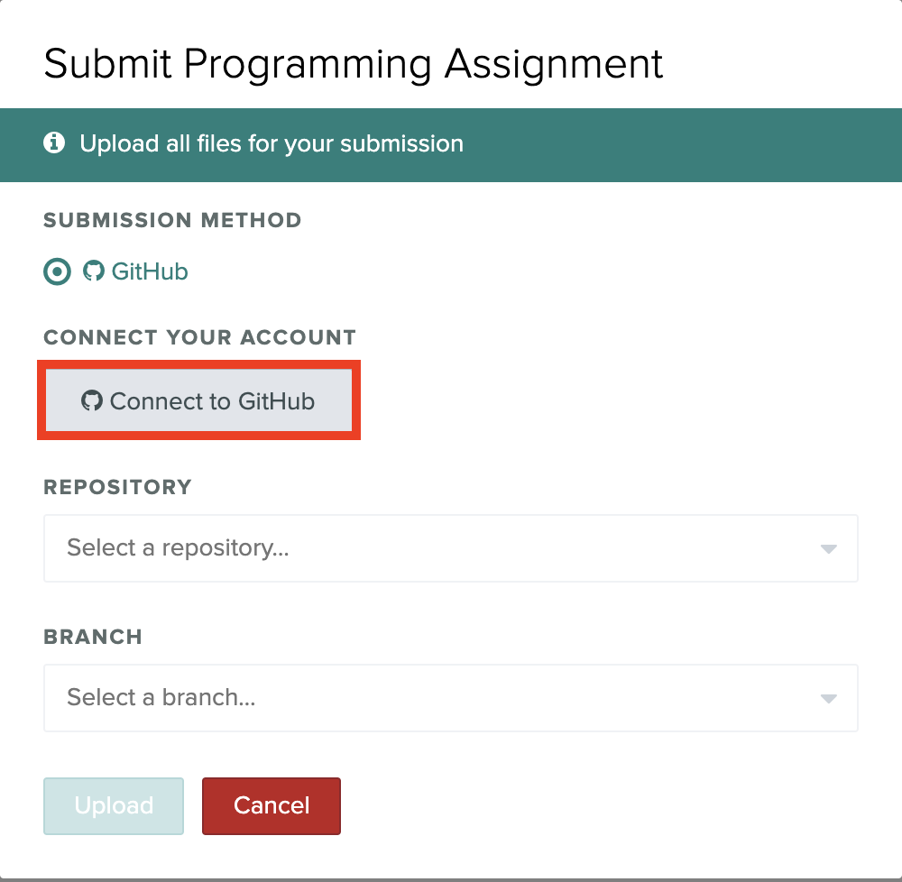

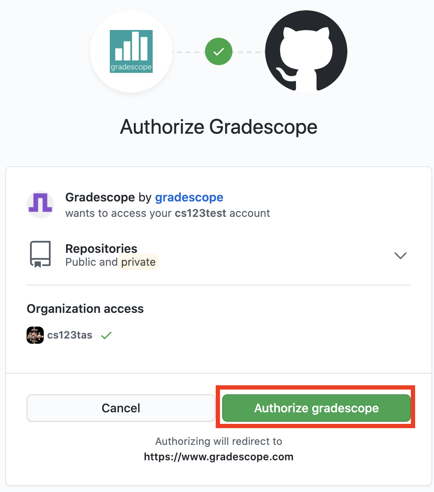

6.  Select your projects repository from the cs123tas organization.

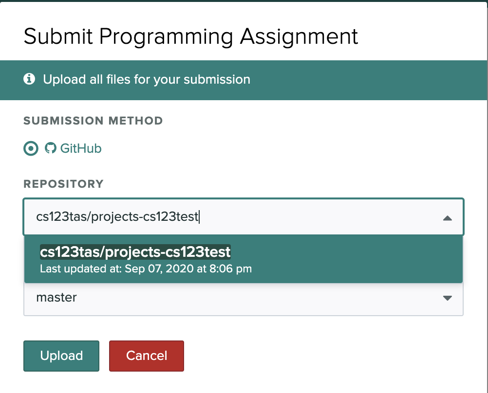

7.  Select the branch you’d like to hand in. In most cases, this will be master.
8.  Click Upload to complete your submission.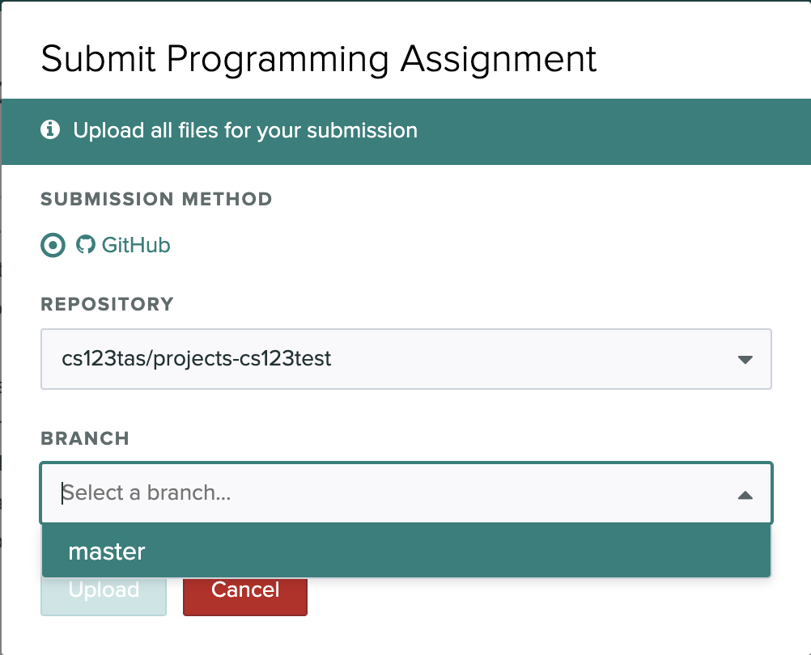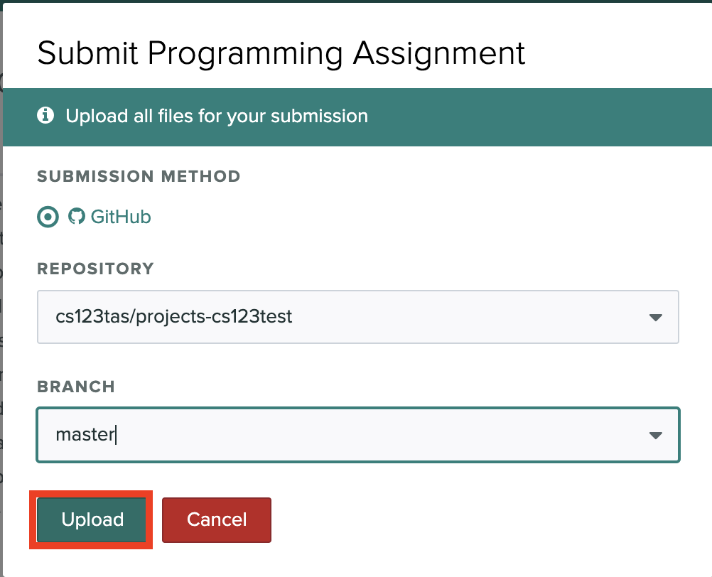

9.  You’ve successfully submitted your assignment! You should see a confirmation message and email.

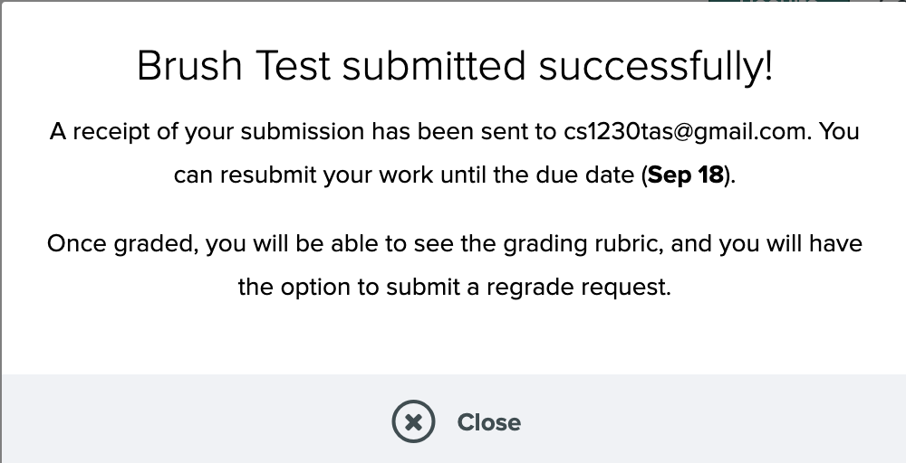
