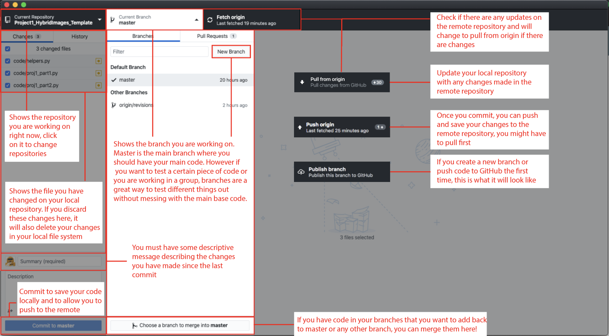

**CSCI 1230 GitHub Guide (adapted from CSCI 1430)**

**What is GitHub?**

GitHub is a version control system that is built on [Git](https://git-scm.com/). It allows one to store code and make changes to an online repository. This allows one to easily change and update code as well as collaborate with others by sharing a common repository. We will be using GitHub Classroom to distribute all of the stencil code for assignments using a link on the course website, but let’s learn a little more about GitHub and Git.

**Why GitHub?**

- Store your code and files on an online repository so you won’t lose your code.
- If you commit (save) and push your code often:
  - If your computer crashes or you make a mistake, you can revert to an earlier version of your code and keep working
  - You can create a record of changes and always check out a previous version
- Allows for easy collaboration. People can work on the same repository and update/change code on seperate machines.
- You can sign up for an account [here](https://github.com/join) and get the [GitHub Student Pack](https://education.github.com/pack) with your Brown Email for more tools and features

**Some Essential Commands of Git**

[Git](https://git-scm.com/) is the basis of GitHub and is a version control system you can use right from the command line, you can learn more about it on their website!

- Download the latest version of Git [here](https://git-scm.com/downloads)
- Check out the installation guide [here](https://git-scm.com/book/en/v2/Getting-Started-Installing-Git).
- There is also a great cheat sheet of git commands that GitHub provides [here](https://education.github.com/git-cheat-sheet-education.pdf).

Below are some common git commands to get you started!

|git clone [URL-or-path-to-repo]|retrieve an entire repository from a hosted location via URL to your local machine|
| - | :- |
|git add [file]|Add the given file to the repository. Use this when you create a new file and want to include it in a commit. Alternatively, include [-a] to add all files from your local repo|

|git commit -m “[some message]”|
Commit your code to finalize and save changes to your current branch and repo on your local machine.

Include [-a] to automatically add changed files that git is already tracking and [-m “[some message]”] to include a message about the commit (otherwise you will be kicked to an editor in which to type out your message).
|
| - | - |
|git push|Push whatever commits you have made locally to the repository you cloned from to save your changes to the online repo. (You might have to pull first to sync with the remote repository)|
|git pull|Pull any changes from the remote repository you cloned from.|
**Github Desktop**

If you prefer GUIs we recommend using GitHub Desktop, this gives you a great visual way of interacting with GitHub.

Download [GitHub Desktop ](https://desktop.github.com/)Step by step [Guide](https://help.github.com/en/desktop)

Figure 1: General display of the features provided by GitHub Desktop
